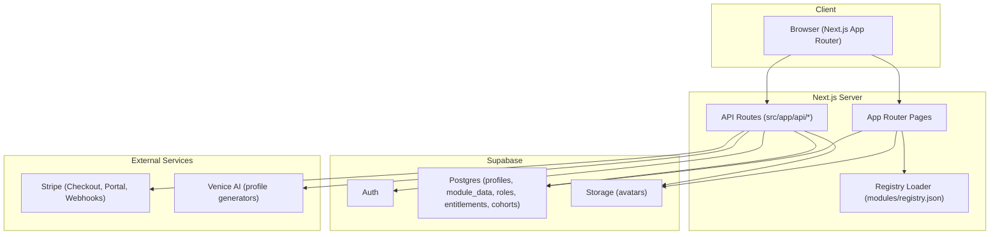

# Architecture Overview

## System Overview
RaidGuild Portal is a Next.js (App Router) application that renders a registry-driven portal, profile directory, and module surfaces. It uses Supabase for auth, data, and storage, and integrates Stripe and Venice AI for billing and profile generators.

```
Browser
  |
  |  Next.js App Router (pages, server components)
  v
Next.js Server (API routes)
  |-- Supabase (auth, db, storage)
  |-- Stripe (billing, entitlements)
  |-- Venice AI (profile generators)
```

## Architecture Diagram


## Core Concepts
- Module registry: `modules/registry.json` is the source of truth for modules; tags determine where modules surface.
- Module types: `link` (external) and `embed` (iframe).
- Module summaries: static or API-backed summaries for cards and surfaces.
- Module data API: module-owned JSON payloads in `public.module_data` gated by module keys.
- Roles and entitlements: Supabase tables drive host-only modules and billing access.

## Runtime Architecture
- Pages live in `src/app` (App Router). Public routes render server components, then query Supabase or API routes as needed.
- API routes under `src/app/api` handle data access, Stripe, and module summaries; most write operations use the Supabase admin client.
- Module registry is loaded server-side from disk via `src/lib/registry.ts`.

## Data Stores (Supabase)
Primary tables (see `supabase/migrations`):
- `profiles`: public profile data.
- `role_catalog`, `skill_catalog`: curated options for profiles.
- `user_roles`: user role assignments (e.g., host).
- `entitlements`: access grants (Stripe-backed).
- `modules`: optional registry sync target.
- `module_keys`: SHA-256 hashes for module data writes.
- `module_data`: JSON payloads by module and user.
- `announcements`: portal announcements.
- `cohorts`, `cohort_content`, `cohort_applications`: cohort data.

Storage:
- `avatars` bucket stores profile images (public URLs stored in profiles).

## External Services
- Supabase: auth, database, and storage.
- Stripe: Checkout, Customer Portal, and webhook for entitlements.
- Venice AI: text/image generation for profile generators.

## Key Routes and APIs
Pages:
- `/`, `/people`, `/people/[handle]`, `/me`
- `/modules`, `/modules/[id]`
- Portal-owned modules: `/modules/announcements`, `/modules/skills-explorer`,
  `/modules/profile-generators`, `/modules/billing`, `/modules/cohort-application`,
  `/modules/cohort-hub`

APIs (selected):
- `GET /api/modules`: returns registry JSON.
- `GET /api/people`, `GET /api/people/[handle]`: public profile read.
- `POST /api/profile`: profile write API.
- `GET/POST /api/module-data`: module data API.
- `GET/POST /api/announcements`: announcement read/write.
- `GET /api/cohorts`, `GET /api/cohorts/[id]`: cohort data.
- `GET/POST /api/cohort-applications`: application workflow.
- `POST /api/stripe/checkout`, `POST /api/stripe/portal`, `POST /api/stripe/webhook`: billing.

## Libraries and Key Modules
- `src/lib/registry.ts`: registry loader and helpers.
- `src/lib/supabase/*`: browser, server, and admin clients.
- `src/lib/stripe.ts`: Stripe utilities and entitlement constants.
- `src/components/*`: shared UI for modules, profiles, and navigation.
- `src/modules/*`: portal-owned module implementations and docs.

## Configuration
Required env vars (see `README.md`):
- Supabase: `NEXT_PUBLIC_SUPABASE_URL`, `NEXT_PUBLIC_SUPABASE_PUBLISHABLE_KEY`,
  `SUPABASE_URL`, `SUPABASE_SERVICE_ROLE_KEY`
- Stripe: `STRIPE_SECRET_KEY`, `STRIPE_WEBHOOK_SECRET`, `STRIPE_PRICE_ID`,
  `STRIPE_PORTAL_CONFIG_ID` (optional)
- Venice AI: `VENICE_API_KEY`, `VENICE_MODEL`, `VENICE_IMAGE_MODEL`,
  `VENICE_API_BASE_URL` (optional)

## Scripts
- `npm run sync:modules`: sync registry into `public.modules`.
- `npm run module:key`: create a module key + hash for `public.module_keys`.

## Deployment Notes
- Built for Vercel. Environment variables must be set in the deployment environment.
- Supabase migrations and generated types live in-repo for tight schema coupling.
